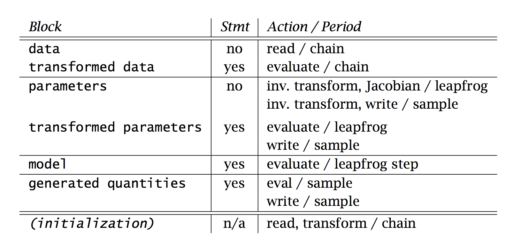

## 6. プログラムブロック

Stanプログラムは名前をつけられた一連ブロックに沿って構成され，ブロックの中には変数の宣言が含まれており，いくつかのブロックはそのあとに文を含みます。

### 6.1 Stanのプログラムブロックの概略

名前をつけられたプログラムブロックのフルセットの例は，次のような骨格を持ったStanプログラムです。

```
functions{
	//... 関数の宣言と定義
}
data{
	//... 宣言
}
tramsformed data{
	//... 宣言 ... 文 ...
}
parameters{
	//... 宣言
}
transformed parameters{
	//... 宣言 ... 文 ...
}
model{
	//... 宣言 ... 文 ...
}
generated quantities{
	//... 宣言 ... 文 ...
}
```

関数定義ブロック(functionブロック)は，ユーザーが定義した関数を含みます。dataブロックはモデルが必要とするデータを宣言します。transformed dataブロックは定数の定義やデータの変換をするところです。parametersブロックはモデルのパラメータを宣言します。制約されていないパラメータはサンプリングされる，あるいは最適化される目的となるものです。transformed parametersブロックはこの後で使われるデータやパラメータから定義される変数を書くところで，この変数は保存されます。modelブロックは対数確率関数が定義されるところです。generated quantitiesブロックはパラメータ，データ，任意の(擬似)乱数生成などに基づいて導出された量を作るところです。

#### 選択と順序

全てのブロックは取捨選択できます。これが意味するのは，Stanコンパイラが警告が発せられるようなことがあったとしても，空の文字列でも構わないということです。Stanのプログラムブロックは上で示したプログラムの骨格で示された順番に置かなければなりません。各ブロックの中では，宣言や文は選択性ですが，宣言が文の前に来なければならないという制約はあります。

#### 変数のスコープ

各ブロックで宣言された変数は，それ以降全ての文に対してスコープを持ちます^[訳注；スコープとは「見える範囲」という意味で，変数名や関数名が参照できる範囲のことです。]。つまり，transformed dataブロックで宣言されあ変数はmodelブロックで使うことができます。でも，generated quantitiesブロックで宣言された変数はそれより前のどのブロックでも使うことができません。もちろんmodelブロックでも。このルールの例外は，モデルブロックで宣言される変数で，modelブロックでの変数は常にmodelブロックローカルであり，generated quantitiesブロックでもアクセスすることができません。すなわちmodelとgenerated quantitiesブロックでの変数にアクセスできるようにしようと思うなら，transformed parameterブロックで宣言しなければなりません。

関数のパラメータとして宣言された変数のスコープは，関数定義のボディの中だけで有効で，（定数を）割り当てることはできません。

#### 関数のスコープ

functionブロックで定義された関数は，任意のブロックで利用できます。ほとんどの関数はどのブロックでも使用でき，パラメータやデータを混ぜるのにつかたりできます（定数やリテラルを含むこともできます）。

乱数を生成する関数は，generated quantitiesブロックに限定されます。そのような関数は後ろに`_rng`をつけます。**対数確率を変更した関数は，その対数確率を累積する計算をブロック（trasnformed parametersとmodelブロック)のスコープの中におきますが**，そのような関数は後ろに`_lp`をつけます。

プログラムの中で宣言される密度関数は，サンプリング文で使えます。

#### 自動変数宣言

`data`と`parameters`ブロックで宣言された変数は，使われる文脈に応じて自動的に定義された変数と比べると，扱いが異なります。これが，なぜdataブロックやparametersブロックで宣言しない変数が許されないかの理由です。

`data`ブロックにおける変数は，外部の入力ソース，例えばファイルや指定されたRのデータ構造を持ったものから読み込まれるものです。`parameters`ブロックの変数はサンプラーが現在のパラメータ値(標準のHMCやNUTSにおけるもの)から読み込まれるものです。初期値は外部の入力ソースから与えらえることもあり，その場合は普通ファイルや指定されたRのデータ構造を持っています。いずれの場合でも，パラメータはモデルが定義する対数確率関数に沿って具体的な値へと具現化されます。

#### 変数変換

`transformed data`と`transformed parameters`ブロックは，いずれも同じような振る舞いをします。いずれも新しい変数を宣言でき，さらに一連の文を通じて定義されます。変数のスコープはそのあとのどの文にも及びますので，データ変換された変数はデータ変数で定義されます。

サンプルを生成する前に，データ変数は読み込まれ，それから変換されたデータ変数が宣言され，それを定義する文とともに構成されます。これが意味するのは，transformed dataブロックにおける文は一回だけしか評価されないということです^[もしC++のコードが同じスレッドで構成されていたら，dataとtransformed dataブロックは一回実行されてから，複数のチェインで再利用されます。]。transformed parametersも同じような動きをし，パラメータの項で定義されます。data変数とtransformed data変数のように。この違いは評価の頻度です。パラメータは読み込まれ，本来のスケールに基づいて対数確率と勾配の評価があるたびに，(逆に)変換されて制約された形に表現し直されます。これが意味するのは，逆変換やその**対数絶対ヤコビアン行列式log absolute Jacobian determinants**はリープフロッグステップ一回ごとに評価されるということです。それから変換されたパラメータは宣言され，一回のリープフロッグステップごとにそれを定義する文が実行されます。

#### 生成量

生成量変数は，全てのリープフロッグステップが終わった後で，一回のサンプルごとに定義されます。これらは確率量かもしれないので，ブロックはHMCやNUTSのメトロポリス最適化がアップデートした提案をリジェクトした時でも再実行しなければなりません。

#### 変数の読み書き，定義の要約

変数を読んだり書いたりするときの要点と定義を示した表を図6.1に示しました。変数を見るときの一つのやり方は，その関数の項を見ることです。どの変数を使おうか決めるには，図6.2のチャートを参考にしてください。最終行は該当する場所がありませんが，それはパラメータに依存しない変数を各iterationで表示する必要がないからです。この章の残りは，変数や文が各ブロックでいつ，どのように実行するかの詳細を完全に記載します。




図6.1: 最後の列に書いてあるread,　write transform そして評価と**predicities**は，最初の列にあるStanプログラムブロックと対応しています。真ん中の列が示すのは，そのブロックが文を許すかどうかです。最後の行が示すのは，パラメータの初期化がread, transformの操作が各チェインについて必要であることを表しています。


図6.2:この表が示すのは，もとになるデータやパラメータではない変数を宣言すべき場所を示しており，パラメータの項を定義すべきかどうか，モデルブロックで定義される対数確率関数で使われるかどうか，表示するかどうかを表しています。アスタリスク(\*)が付いている二つの行は，いかなるパラメータの値にも依存しない変数をiterationごとに表示する必要がないときは，使うべきではないことを意味しています（必要なときにどうやってこれらを表示するかに付いての情報は，この章の脚注2をみてください）。

### 6.2 統計的変数分類法

(Gelman and Hill, 2007, p.366)は，ベイジアンモデリングで用いられている変数の分類法を提案しています。図6.3には，欠損データも含めてGelman and Hillの変数分類に沿って，Stanで宣言したり定義したりする場所を示しています。

定数はリテラル，データ変数，あるいは変数変換後の変数としてモデルに組み込むことができます。


図6.3:左の列に示されている種類の変数は，右の列で示されているブロックのどれか一つの中で宣言されている必要があります。

もし定数がデータ変換する変数の中で使われていたら，`data`ブロックにおいて要素のサイズを特定するのに使うことはできません。

```
data{
		int<lower=0> N;   //モデル化されないデータ
		real y[N];        // モデル化されるデータ
		real mu_mu;       // 設定。モデル化されないパラメータ
		real<lower=0> sigma_mu; // 設定。モデル化されないパラメータ
}
transformed data{
	real<lower=0> alpha;  // 定数。モデル化されないパラメータ
	real<lower=0> beta;   // 定数。モデル化されないパラメータ
	alpha = 0.1;
	beta = 0.1;
}
parameters{
	real mu_y;           // モデル化されるパラメータ
	real<lower=0> tau_y; // モデル化されるパラメータ
}
transformed parameters{
	real<lower=0> sigma_y;   // 導出される量(パラメータ)
	sigma_y = pow(tau_y, -0.5);
}
model{
	tau_y ~ gamma(alpha,beta);
	mu_y ~ normal(mu_mu,sigma_mu);
	for (n in 1:N)
		y[n] ~ normal(mu_y, sigma_y);
}
generated quantities{
	real variance_y;     // 導出される量(変換するもの)
	varianve_y = sigma_y * sigma_y;
}
```

この例では，`y[N]`がモデル化されるデータベクトルです。`data`ブロックで特定されているので，プログラムが走る前に既知の値を持っている必要があり，モデルの中で記述されているようにまるで乱数によって生成されているかのようにモデル化されています。

変数`N`はモデル化されないデータの典型例です。これはサイズを表していますが，モデルそのものの部品にはなりません。

dataやtransformed dataブロックで宣言されている他の変数は，モデル化されないパラメータの例で，ハイパーパラメータとして知られているものです。モデル化されないパラメータは，それ自身確率的なモデル化がされない確率密度のパラメータです。Stanにおいては，`data`ブロックに置かれたモデル化されないパラメータは，データが読まれる場所を実行するとき，モデルごとに特定されます。上のモデルでは，`mu_mu`と`sigma_mu`は設定可能なモデル化されないパラメータです。

モデルにおいて*hard cord*される，モデル化されないパラメータは`transformed data`ブロックで宣言する必要があります。例えばモデル化されないパラメータである`alpha`と`beta`はいずれも，値が$0.1$に固定されています。このような変数が，プログラムが実行されるときにデータが供給されることで設定可能になるような変数にするためには，`mu_mu`や`sigma_mu`のように`data`ブロックで宣言されなければなりません。

このプログラムは二つのモデル化されるパラメータ，`mu`と`tau_y`を宣言しています。これらは`y`の値における正規分布の位置と精度を表しています。モデルの中心は，これらのパラメータの値を事後分布からサンプリングしてくることです。

モデル化されたパラメータ`tau_y`は，`transformed parameters`ブロックにおいて，精度からスケールパラメータへと変換され，変数`sigma_y`に割り当てられています。つまり，変数`sigma_y`は生成量なのです。--この値は他の変数の値によってすっかり決められてしまいます。

`generated quantities`ブロックは`variance_y`の値を決めていますが，ここではスケール，すなわち偏差のパラメータ`sigma_y`を返還することで定義されています。モデルの中で使われていないので，generated quantitiesブロックの中で定義されるのです。これを生成量として作ることで，収束をモニターすることができます(非線形返還なので，自己相関が異なるため，偏差そのものよりも収束の特性を示すのです)。

Stanのより新しいバージョンでは，分布から乱数を発生させ，`generated quantities`ブロックがモデルチェックのための再現データ生成に使えるようになるでしょう。

最後に，変数`n`は`model`ブロックのループの時に使われます。

### 6.3.プログラムブロック：`data`

この章の残りは，潤に各ブロックの詳細を示していくことにします。まずこのセクションでは`data`ブロックから始めます。

#### 変数の読み込みと変換

`data`ブロックは，データとして読み込まれる変数の宣言をするところです。現在の実行ファイルでは，各サンプルのマルコフチェインが異なるプロセスで実行され，各プロセスがデータを一度だけ読み込むようになっています^[複数のスレッドを使う時，あるいは一つのスレッドでチェインが順番に実行されていく時でも，データはチェインごとに1度ずつ読み込まれます。Stanはスレッドが安全であるようにデザインされており，将来のバージョンではマルコフチェインごとにマルチスレッド化するオプションを提供するでしょう。]，

データ変数は決して変換されません。データファイルの形式，あるいはメモリーにあるデータはインターフェイスに依存します。PyStan,RStan,CmdStanなどのインターフェイスに関するユーザーガイドを参照してください。

#### 文

`data`ブロックは文を含むことを許しません。

#### 変数制約のチェック

各変数の値はそれが読み込まれる時，宣言したものに合致しているかどうか確認されます。例えば，もし変数`sigma`が`real<lower=0>`で宣言されていたとして，負の値をわりふろうとしたらエラーが生じます。結果として，データ型のエラーがすぐさまキャッチされます。同様に，含まれるデータ構造と違うサイズのデータを与えようとした時も，エラーが生じます。

### 6.4 プログラムブロック：`transformed data`

`transformed data`ブロックはプログラム実行時に変える必要のない変数を宣言したり定義したりする箇所です。

#### 変数の読み込みと変換

`transformed data`ブロックでは，変数は全て変数宣言の時に宣言されていて，文によって定義されます。外部ソースから読み込んだり，変形を行うわけではありません。

`data`ブロックで宣言された変数は，変換される変数の宣言に使われるかもしれません。

#### 文

`transformed data`ブロックにおける文は，`transformed data`ブロックで宣言された変数を定義する(値を与える)ために用いられます。変数に値を与えるのが許されるのは，`transformed data`ブロックだけです。

ここでの文はデータがデータ変数に読み込まれたすぐ後に，一度だけ，順次実行されます。つまり，一つのチェインごとに一度実行されるということです(本章の脚注3をみてください)。

`data`ブロックでで宣言された変数は，`transformed data`ブロックの文で使うことができます。

##### `transormed data`における操作の制限

`transformed data`ブロックにおける文は，一度だけ実行するようにデザインされており，また一意に定まる結果を持ちます。つまり，対数確率は加算されませんし，サンプリング文も使うことができません。確率的な数字を生成する関数も禁止されています。

#### 変数製薬のチェック

`transformed data`ブロックで宣言された変数に対するあらゆる製薬は，文が実行された後でチェックされます。もし定義された変数のどれかがこの制約を違反すれば，Stanは診断的なエラーメッセジとともに実行を中止します。

### 6.5 プログラムブロック:`parameters`

`parametrers`ブロックで宣言された変数は，Stanのサンプラー(HMCとNUTS)でsんプルされる変数と直接対応しています。ユーザーの観点からはプログラムブロックにおけるパラメータ**こそが**，Stanでサンプルされるものです。

パラメータで宣言される変数に，直接値を割り当てることはできません。ですから，`parameters`ブロックには文のブロックがありません。パラメータから導出される変数の値は，`transformed parameters`か`generated quantities`ブロックで宣言されるか，ローカル変数として制限される時にその宣言に続く文のブロックで定義されます。

StanプログラムのHMCやNUTSサンプラーにおける各リープフロッグステップによって，パラメータ変数は実質的な量が計算され，サンプルに対応するパラメータの値を保持する書き込みなどが少し計算されます。

#### 逆変換についての制約

Stanの二つのサンプラー，標準的なハミルトニアンモンテカルロ(HMC)と適合型No-U-Turnサンプラー(NUTS)は，最も簡単に(そして時には最も効果的に)，全ての$\mathbb{R}^n$をサポートする多変量確率密度を覆うように実装されます。これを実現するために，`parameters`ブロックで定義されるパラメータは，制約されない形に変換されなければなりません。

実際には，サンプラーはメモリーの中に，サンプラーの現在の状態を表している制約されていないパラメータベクトルを保持しています。Stanプログラムで定義されたモデルは，制約されていないパラメータについて(正規化されていない)対数確率関数を定義します。そのために，対数確率関数はStanの`parameters`ブロックにおいて定義された制約付きパラメータを計算するために，逆変換を施して制約されていないパラメータにします。この逆変換のログヤコビアンが，そのあと累積対数確率関数に加算されます。これが，制約さつきパラメータの項からStanモデルが定義されることを許してくれるのです。

場合によっては，パラメータの数が制約されていない空間の中で減ることがあります。例えば，K-simplexに必要な制約されてないパラメータの数は$K-1$個だけですし，K次元の相関行列に必要な制約されていないパラメータは$\binom{K}{2}$個だけです。つまり，コンパイルされたStanプログラムによって定義された確率関数は，`parameters`ブロックで宣言されている時に見えるものよりもより少ない数のパラメータしか持っていないことがあります。

制約されていないパラメータにおける確率関数は，`parameters`ブロックで定義された変数の次数に対応した次数のパラメータで定義されます。特殊な変換の詳細については，34章で提供されます。

#### 勾配の計算

ハミルトニアンモンテカルロ法では，毎回のリープフロッグ・ステップを評価する際に，制約されていないパラメータについて(正規化されていない)対数確率関数の勾配が必要になります。サンプルごとに1リープフロッグ，あるいはより複雑なモデルがもつ複雑な事後分布幾何空間であれば数百はあります。

勾配はStanのアルゴリズム微分ライブラリを使う時に，背後で計算されています。勾配を計算する時間は，パラメータの数に直接対応しておらず，対数確率の計算における副次式の数だけに依存しています。ここには，ヤコビアンの変換から加えられる式が含まれます。

サンプラーによってなされる仕事の量は，制約されていないパラメータの数に依存しますが，これは普通，勾配の計算によって小さくされます。

#### サンプルを書き込む

基礎的なStanのコンパイルされたプログラムは，変数の値はサンプルごとにファイルに書き出されます。変数の制約されたバージョンが書き出されるのは，`parameters`ブロックで定義された順に従います。そのため，変換されたパラメータ，モデル，生成量の文は実行済みである必要があります。

### 6.6 プログラムブロック:`transformed parameters`

`transformed parameters`ブロックは，任意の変数宣言と，それに伴う文からなります文が実行された後，変換されたパラメータにおける定数が有効ニアなります。パラメータ変換の時に宣言されたあらゆる変数は，サンプルによって作られるアウトプットの一部になります。

データ，あるいは変換されたデータの中ですっかり定義されている変数はいずれも，`transformed data`ブロックで宣言，あるいは定義されていなければなりません。こうした量を`transformed parameters`ブロックで定義することは可能ですが，`transformed data`のところで定義する場合に比べてあまり効率が良くありません。

#### エラーチェックのための制約

データの制約のように，パラメータ変換で制約することは，思い通りのパラメータをもたらすためにプログラムのエラーをキャッチする時に便利です。満足させるために自動的に変換されるわけではありません。変換されたパラメータが制約に合致していないときに起こるのは，現在のパラメータ値の棄却です。これが生じるのは，Stanのアルゴリズムがランダムウォークにおいて引っかかるか退化するからです。これはStanプログラムにおいて，事後的に制約を実行する方法ではありません。セクション5.10には，棄却文の振る舞いについて，より詳しい議論があります。

### 6.7 プログラムブロック：`model`

`model`ブロックは任意の変数の宣言とそれに連なる文からなります。モデルブロックにおける変数はローカル変数で，出力の一部には含まれません。

ローカル変数は制約付きで定義されません。というのもそれらをフレキシブルかつ簡単に有効にするうまい方法がないからです。

モデルブロックにおける文は，普通モデルを定義するものです。このブロックでは，確率表現(サンプリング記法による)が可能です。それらは典型的には，BUGSでプログラミングする時に確率モデルを定義したやり方を使います。

### 6.8 プログラムブロック:`generated quantities`

`generated quantities`ブロックは，他のブロックとは幾分異なっています。生成量のブロックでは，サンプルされたパラメータの値に影響することはありません。このブロックはサンプルが生成された後に実行されるものです。

事後的な推論をする時に使うために，生成量ブロックでコード化されるのは，次のようなものです。

+ モデル検証のためにシミュレートされたデータを生成する，フォワードサンプリング
+ 新しいデータの予測値の生成
+ 事後生起確率の計算。多重比較や符号検定を含む。
+ 事後予測の計算
+ レポートのためのパラメータの変換
+ ベイジアン意思決定理論を完全に適用する
+ モデル比較のための対数尤度，逸脱度などの計算

フォワードサンプルや生起確率は，プラグイン推定を直接使うことで計算されます。Stanは生起確率，予測，統計量などのあらゆる計算によって事後確率からサンプルを作ることで，自動的にフルベイジアン推論を行います。28章にはベイズ推論についてより詳しい情報があります。

生成量ブロックの中では，そこまでのプログラムブロックの中で宣言された他のすべての変数(ローカル変数以外)を，使うことが可能です。

パラメータ変換ブロックの代わりに生成量ブロックで変数を定義することが，効率的なこともあります。つまり，もしその量がモデルの中で役割を持っていないのであれば，生成量ブロックで定義すれば良いのです。

生成量の文が実行された後，宣言された生成量の制約が有効になります。

生成量として宣言されたあらゆる変数は，出力の一部として表示されます。

